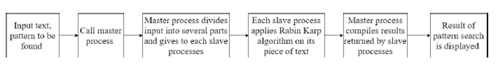
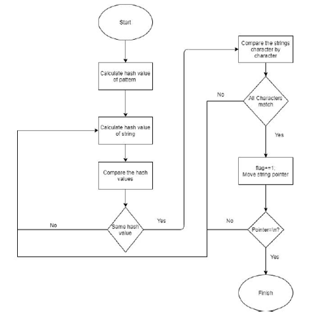
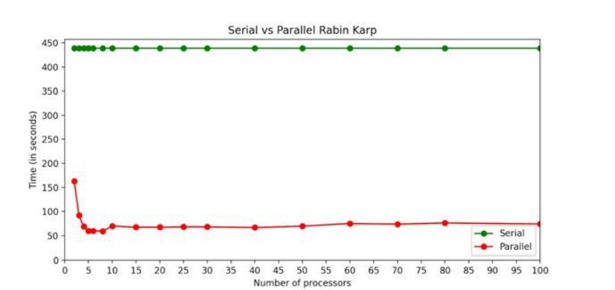

# Parallelization of Rabin Karpp algorithm

The Rabin-Karp algorithm is an implementation of exact string 
matching that uses a rolling hash to find any ‘one’ set of pattern strings 
in a text. The Rabin-Karp algorithm is used in detecting plagiarism 
because, given a pattern and a source of texts, the algorithm can quickly 
search through papers for patterns from the source material. We have 
parallelized this algorithm using MPI, Distributed Python – disPy


## Objective 

This project aims to improve the process of hashing by parallelizing the 
process using MPI. A given set of input will be tested first by the serial 
method and then by parallel and we will see the advantage of parallelism


## Methodology

We have used the master-slave model in MPI to parallelize the Rabin 
Karp algorithm. Files with a large amount of text and a pattern to be 
searched within them, are given as input. The master process takes this 
input and divides the files among the slave processes. Each slave 
process performs the Rabin Karp algorithm on its input file and returns 
the results to the master. The master process compiles the results and 
displays them


## Block Diagram



## Flow chart


## Requirements
- Windows 10
- Python 3
- Pip

## Installation
```
- Download the latest version of MS-MPI from https://www.microsoft.com/en-us/download/details.aspx?id=100593
- Run both the files
- Add C:\Program Files (x86)\Microsoft SDKs\MPI to Path user environment variable
- run "pip install mpi4py" in cmd
```
## Execution
```bash
Open cmd
cd [location of folder]
Serial: python RabinKarpSerial.py filenames.txt multipattern.txt
Parallel: mpiexec -n [no of processors] python pdc_parallel.py filenames.txt multipattern.txt
```
## Result



